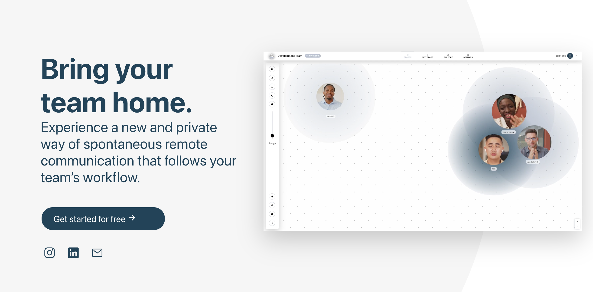

# [Yacht.Chat](https://www.yacht.chat)

Yacht.Chat is built on a robust and modern technological architecture, focusing on scalability, security, and low-latency communication. Here's a detailed breakdown of the technology stack:

## Backend: Spring
The backend of Yacht.Chat is crafted on the Spring Framework. Spring is a renowned, open-source application framework. Its flexibility and scalability make it a perfect choice.

## Frontend: TypeScript, React
On the frontend, Yacht.Chat employs the React library and TypeScript. React, a widely-used JavaScript library for building user interfaces, combined with TypeScript, a statically typed superset of JavaScript, ensures reliability and maintainability of the codebase.

## Real-time Communication: Peer-to-Peer Technology and Selective Forward Unit
For real-time video conferencing, Yacht.Chat uses peer-to-peer technology. This direct data transfer method reduces the load on servers, ensuring efficient communication. Along with this, a Selective Forward Unit (SFU) is used, capable of receiving multiple media streams and deciding which to forward. This feature further optimizes real-time video communication during multi-party conferences.

## Authentication: Keycloak, Google, LinkedIn
In the domain of user authentication, Yacht.Chat integrates Keycloak, an open-source Identity and Access Management solution. Keycloak provides advanced security features such as Single-Sign On, Identity Brokering and Social Login, User Federation, and Client Adapters.

Furthermore, Yacht.Chat allows users to log in using their Google or LinkedIn accounts. This feature not only makes the login process convenient and user-friendly but also maintains high security and privacy standards.
